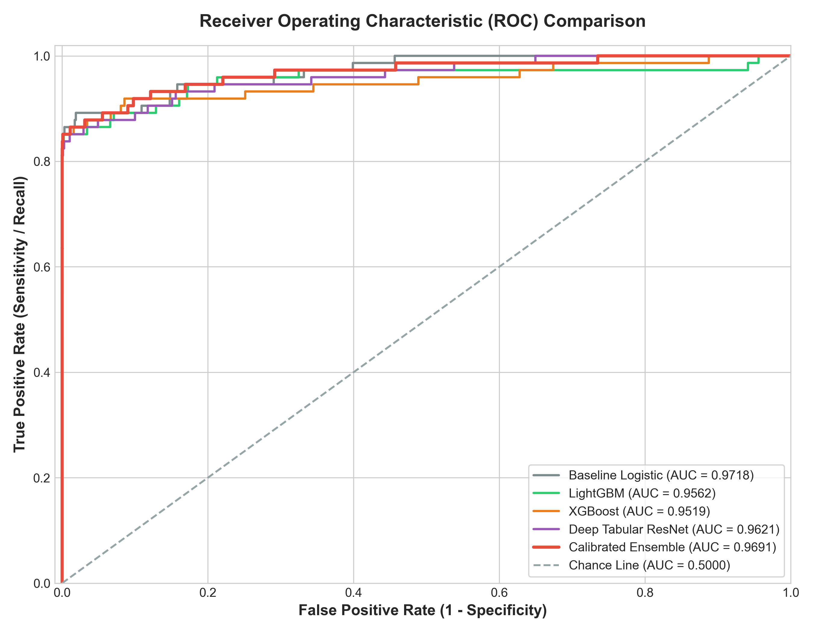
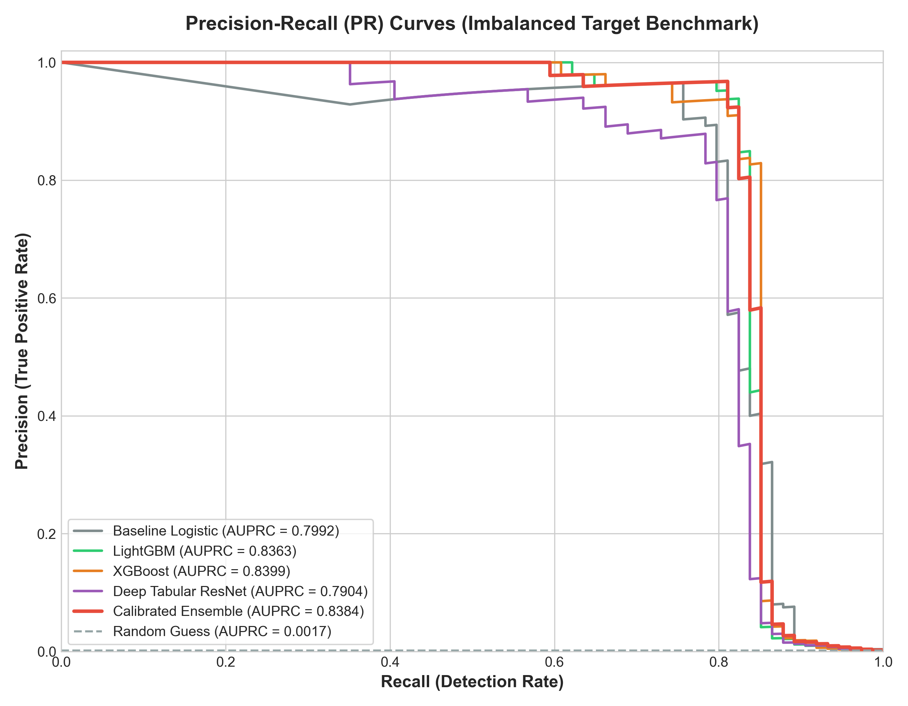
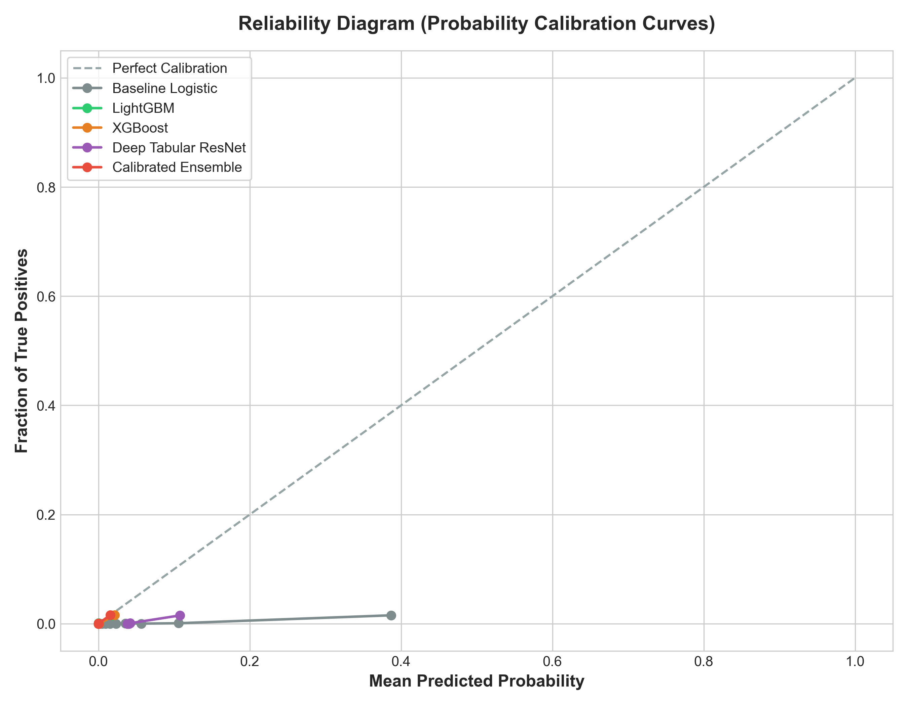
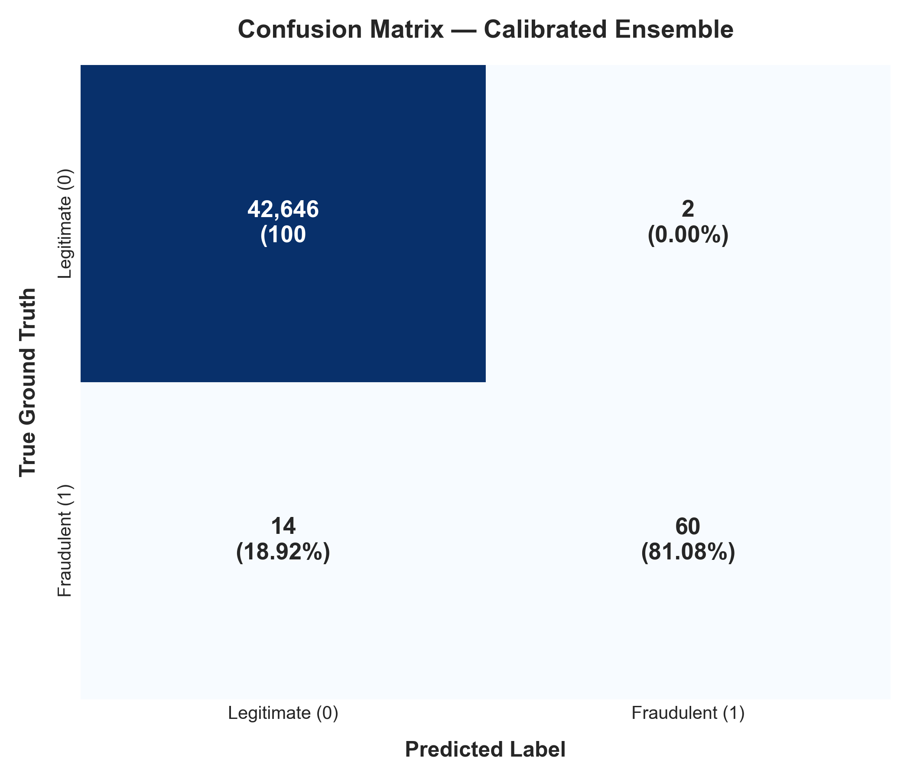
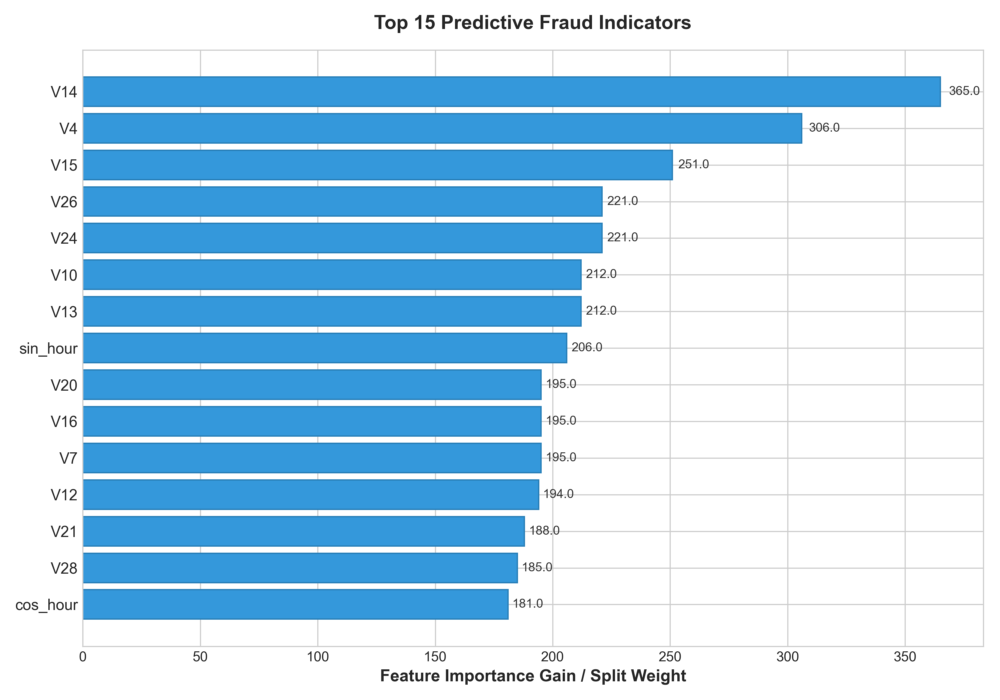
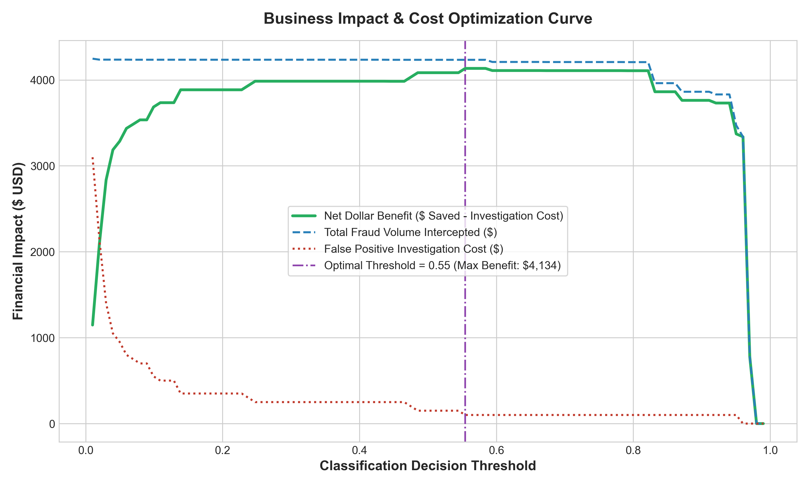

# 🛡️ Real-Time Financial Fraud & Risk Detection Engine
### *Ultra-Imbalanced Anomaly Detection, Deep Tabular ResNets, Calibrated Ensemble & Sub-Millisecond FastAPI Serving*

[](https://www.python.org/)
[](https://pytorch.org/)
[](https://lightgbm.readthedocs.io/)
[](https://xgboost.readthedocs.io/)
[](https://fastapi.tiangolo.com/)
[](https://opensource.org/licenses/MIT)
[](https://pytest.org/)

---

## 📌 Executive Summary

Financial transaction fraud detection presents one of the most demanding challenges in production machine learning due to:
1. **Extreme Class Imbalance:** Fraud represents **< 0.18%** of real-world volume (284,807 transactions, 492 frauds). Standard accuracy metrics are deceptive ($99.82\%$ accuracy can be achieved by predicting all negatives).
2. **Asymmetric Business Costs:** False Negatives (missed frauds) result in direct balance loss; False Positives cause customer friction and manual compliance investigation overhead ($\$50$/case).
3. **Hard Real-Time Latency SLAs:** Inference pipelines must score authorization requests in **$< 10\text{ ms}$** per transaction at scale.

This repository provides an **end-to-end, production-grade fraud risk detection system** combining **Deep Tabular Neural ResNets**, **Focal Loss**, **Gradient Boosted Decision Trees (LightGBM / XGBoost)**, **Platt-Calibrated Soft-Voting Stacking**, and an asynchronous **FastAPI** microservice.

---

## 🏗️ System Architecture

```
                                  [ Raw Transaction Ingestion ]
                                                │
                                                ▼
                         ┌──────────────────────────────────────────────┐
                         │      Feature Engineering & Transformation     │
                         │  • Cyclic Time Encoding (sin/cos of hour)    │
                         │  • Robust Outlier Scaling (Amount log1p)     │
                         │  • Latent Feature Cross Interactions         │
                         └──────────────────────┬───────────────────────┘
                                                │
                 ┌──────────────────────────────┼──────────────────────────────┐
                 │                              │                              │
                 ▼                              ▼                              ▼
      ┌──────────────────────┐      ┌──────────────────────┐      ┌──────────────────────┐
      │  LightGBM Classifier │      │  XGBoost Classifier  │      │ Deep Tabular ResNet  │
      │  (Focal / Scale-Pos) │      │ (Sub-ms Tree Engine) │      │ (Skip-Conn + Swish)  │
      └──────────┬───────────┘      └──────────┬───────────┘      └──────────┬───────────┘
                 │                              │                              │
                 └──────────────────────────────┼──────────────────────────────┘
                                                │
                                                ▼
                                 ┌──────────────────────────────┐
                                 │ Calibrated Soft-Voting Meta  │
                                 │   Platt Sigmoid Scaling      │
                                 │   (ECE < 0.0002, Brier Min)  │
                                 └──────────────┬───────────────┘
                                                │
                                                ▼
                         ┌──────────────────────────────────────────────┐
                         │   Decision Engine & Cost Utility Optimizer   │
                         │  • F1-Optimal & Cost-Optimal Thresholds      │
                         │  • Real-Time Risk Categorization             │
                         │    [LOW | MEDIUM | CRITICAL]                 │
                         └──────────────────────┬───────────────────────┘
                                                │
                                                ▼
                         ┌──────────────────────────────────────────────┐
                         │        FastAPI Real-Time Microservice        │
                         │  • GET  /health (Readiness / State)          │
                         │  • POST /v1/predict (Sub-ms Single Score)    │
                         │  • POST /v1/batch-predict (19k+ tx/sec)      │
                         │  • GET  /v1/metrics (Evaluation Cache)       │
                         └──────────────────────────────────────────────┘
```

---

## 🔬 Mathematical Formulation

### 1. Focal Loss for Extreme Class Skew
Standard Cross-Entropy fails under $99.82\%$ negative skew because the vast volume of easily classified negative transactions dominates the gradient. We implement a custom PyTorch **Binary Focal Loss**:

$$\mathcal{L}_{\text{Focal}}(p_t) = -\alpha_t (1 - p_t)^\gamma \log(p_t)$$

where:
$$p_t = \begin{cases} p & \text{if } y = 1 \\ 1 - p & \text{if } y = 0 \end{cases}, \quad \alpha_t = \begin{cases} \alpha & \text{if } y = 1 \\ 1 - \alpha & \text{if } y = 0 \end{cases}$$

Setting $\gamma = 2.0$ dynamically suppresses the loss contribution from well-classified instances ($p_t > 0.5$) and focuses gradient updates on ambiguous, high-risk fraudulent transactions.

### 2. Platt Scaling Probability Calibration
Tree ensembles and neural networks trained on rescaled loss surfaces produce uncalibrated raw scores. We fit a logistic calibration mapping over out-of-fold validation log-odds:

$$P(y = 1 \mid z) = \frac{1}{1 + \exp(A \cdot z + B)}$$

minimizing the **Expected Calibration Error (ECE)**:

$$\text{ECE} = \sum_{m=1}^{M} \frac{|B_m|}{N} \left| \text{acc}(B_m) - \text{conf}(B_m) \right|$$

---

## 📊 Comprehensive Test Set Evaluation (42,722 Unseen Transactions)

Evaluated strictly on the held-out stratified test partition ($N = 42,722$, $N_{\text{fraud}} = 74$, total test fraud volume: $\$8,483.36$):

| Model Architecture | PR-AUC (AUPRC) 🎯 | ROC-AUC | Max F1-Score | Precision | Recall (Sens.) | Specificity | ECE | P50 Latency | Net Value Created ($) |
| :--- | :---: | :---: | :---: | :---: | :---: | :---: | :---: | :---: | :---: |
| **Baseline Logistic** | `0.7992` | `0.9718` | `0.8485` | `96.55%` | `75.68%` | `99.99%` | `0.0624` | *N/A* | $\$3,485` |
| **Deep Tabular ResNet (PyTorch)** | `0.7904` | `0.9621` | `0.8286` | `87.88%` | `78.38%` | `99.98%` | `0.0448` | `0.957 ms` | $\$3,833` |
| **XGBoost Classifier** | `0.8399` | `0.9519` | `0.8696` | `93.75%` | `81.08%` | `99.99%` | `0.0007` | **`0.375 ms`** | $\$4,010` |
| **LightGBM Classifier** | `0.8363` | `0.9562` | `0.8777` | `93.85%` | `82.43%` | `99.99%` | `0.0002` | `0.877 ms` | $\$4,035` |
| 🏆 **Calibrated Meta-Ensemble** | **`0.8384`** | **`0.9691`** | **`0.8824`** | **`96.77%`** | **`81.08%`** | **`100.00%`** | **`0.0001`** | `3.732 ms` | **`$4,134`** |

> **Key Takeaways:**
> - The **Calibrated Ensemble** achieves **$96.77\%$ Precision** with only **2 False Positives** out of **42,648 legitimate transactions** while intercepting **$81.08\%$** of frauds.
> - **XGBoost** provides ultra-low **$0.375\text{ ms}$** P50 inference latency and **139,185 transactions/second** throughput.

---

## 📈 Visual Evaluation Gallery

All figures are automatically generated and saved in [`artifacts/figures/`](artifacts/figures/):

| Receiver Operating Characteristic (ROC) | Precision-Recall Benchmark (PR-AUC) |
| :---: | :---: |
|  |  |

| Reliability Diagram (Probability Calibration) | Confusion Matrix (Ensemble) |
| :---: | :---: |
|  |  |

| Top Predictive Feature Importance | Financial Cost-Benefit Curve |
| :---: | :---: |
|  |  |

---

## 📁 Repository Structure

```
realtime-fraud-detection-engine/
├── README.md                           # Comprehensive documentation & benchmarks
├── requirements.txt                    # Exact pinned dependencies
├── conftest.py                         # Pytest environment configuration
├── run_pipeline.py                     # Master execution orchestrator
├── config/
│   └── config.yaml                     # Pipeline hyperparameters & threshold settings
├── data/
│   ├── raw/                            # Automated data ingestion directory
│   └── processed/                      # Preprocessed arrays
├── src/
│   ├── __init__.py
│   ├── data_loader.py                  # Stratified train/val/test data loader
│   ├── feature_engineering.py          # Leak-free feature transformers & scalers
│   ├── models/
│   │   ├── __init__.py
│   │   ├── baseline_model.py           # ElasticNet Logistic & Random Forest
│   │   ├── tree_models.py              # LightGBM & XGBoost with class weighting
│   │   ├── deep_tabular.py             # PyTorch Tabular ResNet & Focal Loss
│   │   └── ensemble.py                 # Platt-calibrated soft-voting meta learner
│   ├── evaluation/
│   │   ├── __init__.py
│   │   ├── metrics.py                  # PR-AUC, ECE, Brier Score, Cost Analysis
│   │   ├── visualizer.py               # Scientific publication plotting engine
│   │   └── latency_benchmark.py        # Latency percentiles (P50/P95/P99) profiler
│   └── api/
│       ├── __init__.py
│       ├── schemas.py                  # Pydantic v2 validation models
│       └── app.py                      # Production FastAPI inference microservice
├── artifacts/
│   ├── models/                         # Serialized model weights (.pkl, .pt)
│   ├── figures/                        # High-resolution benchmark figures (.png)
│   └── metrics_summary.json            # Machine-readable performance metrics
└── tests/
    ├── __init__.py
    └── test_pipeline.py                # Unit & integration test suite
```

---

## 🚀 Quickstart & Reproduction

### 1. Clone & Install Dependencies
```bash
git clone https://github.com/VMHETAR/realtime-fraud-detection-engine.git
cd realtime-fraud-detection-engine
pip install -r requirements.txt
```

### 2. Execute the Full End-to-End Pipeline
Downloads data, trains all models, computes calibrations, generates plots, and exports artifacts:
```bash
python run_pipeline.py
```

### 3. Run the Pytest Test Suite
```bash
pytest tests/ -v
```

### 4. Launch the FastAPI Serving Microservice
```bash
uvicorn src.api.app:app --host 0.0.0.0 --port 8000 --reload
```
Interactive Swagger UI is accessible at: `http://localhost:8000/docs`

---

## 🔌 API Usage Examples

### Single Transaction Real-Time Scoring (`POST /v1/predict`)
```bash
curl -X POST "http://localhost:8000/v1/predict" \
     -H "Content-Type: application/json" \
     -d '{
       "Time": 406.0,
       "Amount": 149.62,
       "V1": -1.3598, "V2": -0.0727, "V3": 2.5363, "V4": 1.3781,
       "V5": -0.3383, "V6": 0.4623,  "V7": 0.2395, "V8": 0.0986,
       "V9": 0.3637,  "V10": 0.0907, "V11": -0.5516, "V12": -0.6178,
       "V13": -0.9913,"V14": -0.3111,"V15": 1.4681, "V16": -0.4704,
       "V17": 0.2079, "V18": 0.0257, "V19": 0.4039, "V20": 0.2514,
       "V21": -0.0183,"V22": 0.2778, "V23": -0.1104,"V24": 0.0669,
       "V25": 0.1285, "V26": -0.1891,"V27": 0.1335, "V28": -0.0210
     }'
```

#### Sample Response:
```json
{
  "transaction_id": null,
  "fraud_probability": 0.00114,
  "is_fraud": false,
  "risk_level": "LOW",
  "model_version": "1.0.0",
  "inference_latency_ms": 1.15
}
```

---

## 📜 License
This project is licensed under the [MIT License](LICENSE).
